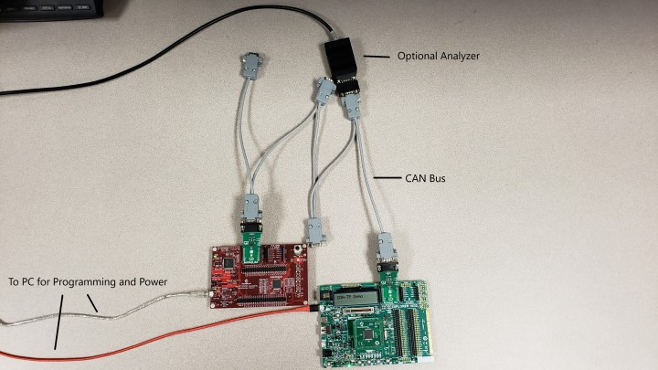
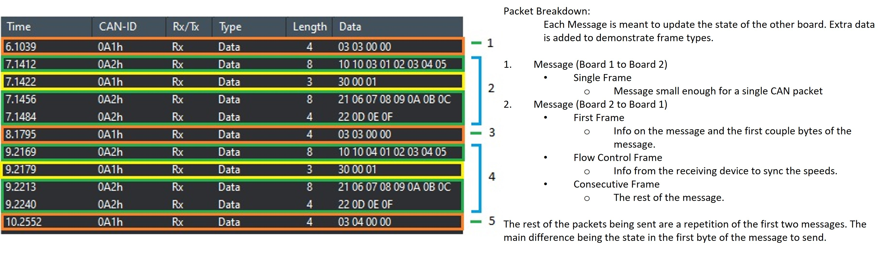

<!-- Please do not change this logo with link -->

# dsPIC33C CAN-TP Demo

The dsPIC33C CAN-TP Demo shows an example configuration of the CAN-TP module (Which follows the ISO 15765-2). The purpose of his demo is to also show how CAN-TP handles messages by having two boards transmitting and receiveing messages over a CAN Bus.

The MPLAB® X demo projects included are set up to utilize specific boards defined in the required hardware section below. The dsPIC33C CAN-TP Demo utilizes resources that are available on most boards(LEDs, Buttons, and mikroBUS slot) allowing the project to be portable to other hardware.

## Related Documentation

[CAN-TP Documentation](https://onlinedocs.microchip.com/oxy/GUID-9C356E20-C5BD-430F-8C0B-CCA1B85ECC7C-en-US-1/GUID-819906F0-FAB5-48EC-8698-1788965B4BAD.html)

## Software Used

### - Required Software

- MPLAB® X IDE  **6.05** or newer (https://www.microchip.com/MPLABXIDE)
- MPLAB® XC16 Compiler **2.00** or a newer compiler (https://www.microchip.com/xc16) 
- MPLAB® Code Configurator (MCC) **5.2.2** or newer (https://www.microchip.com/mcc)
- MPLAB® Code Configurator (MCC) Melody **2.3.1** or newer (https://www.microchip.com/melody)

### - Optional Software

- PCAN-View for recording on the CAN bus (https://www.peak-system.com/PCAN-USB-FD.365.0.html?&L=1)

## Hardware Used

### - Required Hardware
- Debugging tool: MPLAB® PICkit™ 4 In-Circuit Debugger (https://www.microchip.com/PICkit4) **or** PKOB (PICkit On-Board)
- MCP2542 Click x2 (https://www.mikroe.com/mcp2542-click)
- CAN BUS - 1 to 1 CAN cable.
- dsPIC33CK Curiosity Development Board (https://www.microchip.com/dsPIC33CKCuriosity)
- Explorer 16/32 Development Board (https://www.microchip.com/Explorer1632)
- dsPIC33CK256MP508 General Purpose Plug-in Module (https://www.microchip.com/MA330042)

### - Optional Hardware
- CAN BUS - n to n Multi Device CAN BUS for reading off the line with an analyzer.
- CAN Terminator (https://www.gridconnect.com/collections/can-cables-connectors-terminators/products/can-terminator) (Used for CAN-FD and for the Analyzer)
- PCAN-USB FD (https://www.peak-system.com/PCAN-USB-FD.365.0.html?&L=1) (Any CAN analyzer will work)

# Hardware Setup

The dsPIC33C CAN-TP Demo uses the dsPIC33CK256MP508 PIM with Explorer 16/32 Development Board and the dsPIC33CK Curiosity Board. To port to other boards or devices that support CAN/CAN-FD communication in Melody, refer to the **Porting the CAN-TP demo to use a different Board/Device** section below.

1. The Explorer 16/32 board requires the following:
    - MCP2542 Click - inserted into the mikroBUS A slot
    - dsPIC33CK256MP508 PIM inserted into the designated slot
    - USB cable connected from the PC to the PKOB or PICkit 4

2. The Curiosity board requires the following:
    - MCP2542 Click - inserted into the mikroBUS A slot
    - USB cable connected from the PC to the PKOB

3. Connect the devices together using an CAN cable:
    - Insert the ends into each MCP2542 click board
    - **Optional**: Connect a CAN analyzer to the bus to view the frames being sent over the bus
    
- Note: An 120 ohm CAN Bus Terminator may be required for different CAN Bus setups.

**Figure 1 - Setup of the dsPIC33C CAN-TP Demo**

# Software Setup

## Programming the Explorer 16/32 board with dsPIC33CK256MP508 PIM
    1. Open the dspic33ck-explorer1632-can-tp.X project in the MPLAB® X IDE.
    2. Right click the project in "Projects" tab of MPLAB® X IDE and select "Set as Main Project".
    3. Plug in the PICKit 4 from the board to the PC or the PKOB (PICkit On-Board) to the PC.
    4. Program the device by selecting the "Make and Program Device (Project dspic33ck-exp1632-can-tp)" button on the menu bar.
    5. The project should build and program successfully.
    

## Setup for project: dspic33ck-curiosity-can-tp
    1. Open the dspic33ck-curiosity-can-tp.X project in the MPLAB® X IDE.
    2. Right click the project in "Projects" tab of MPLAB® X IDE and select "Set as Main Project".
    3. Plug the PKOB (PICkit On-Board) to the PC.
    4. Program the device by selecting the "Make and Program Device (Project dspic33ck-curiosity-can-tp)" button on the menu bar.
    5. The project should build and program successfully.

# Operation

After programming both boards, ensure both are powered on. Pressing the button S3 on Explorer 16/32 board will start the transmission and reception of the messages between the two devices. 

As one board transmits a message the board recieving that message utilizes the first byte of the message to update its state. The current state will be shown by toggling the LED at different speeds. All other data in the message is strictly added to show the frame types handled by CAN-TP (Refer to **Figure 2** below regarding the frame types). 

The transmission and reception of the messages will continue until one board is manually powered off.
 

**Figure 2 - Recording over the CAN bus**

# Porting the CAN-TP demo to use a different Board/Device
## Device Requirements:
    - Any dsPIC device that supports CAN/CAN-FD in MCC Melody. 
## Board Requirements:
    - LED           (one for each board to show the different states) 
    - Button        (Used for one board ONLY to trigger the start of the loop)
    - mikroBUS slot (one for each board to utilize the MCP2542 click board)
    
The setup below describes the setup for the two boards as well as the CAN/CAN-FD configurations to use. Refer to the **Commonly Used PIMS/Board Pin Selections** section below for more information.

## Setup for Board 1:

    The project for board 1 kicks off the message passing. It requires a button and an LED. This will utilize the dspic33ck-exp1632-can-tp.X project to receive, process and respond to devices with an ID of 0xA2.

    1. Open the dspic33ck-exp1632-can-tp.X project in the MPLAB® X IDE. 

    2. Right click the project in "Projects" tab of MPLAB® X IDE and select Properties. Change the device to the one you are using and select an XC compiler. Apply these settings and continue with the next steps.

    3. Right click the project in "Projects" tab of MPLAB® X IDE and select "Set as Main Project".

    4. Open Melody by selecting the MCC button.

    5. Ensure CAN-TP is added to the project and configure the following:
        - TMR1 for the timer dependency for CAN-TP
        - MessageID is set to 0xA1

    6. Within the Pin Grid View for your board select Pins for the following: (Refer to the board/devices schematics and Pin mapping to choose the correct selections for each option below)
        - Select an LED as output
        - Select an Button for input
        - Select the CAN1TX for your board
        - Select the CAN1RX for your board

    7. Within Pins resource under the Project Resources tab:
        - For the button input selected make the following configurations
            - Enable Weak pullup
            - Select interrupt on negative change
            - Change the custom name to be BUTTON
        - For the LED selected make the folowing configurations
            - Change the custom name to be LED

    8. Select CAN_FD1 and do the following:
        - Enable Data Bit Rate and Set Bit Rate to 2Mbps
        - In filter0's Message ID Set it to 0xA2

    9. Select the Generate Button under project resources.
        - DO NOT overwrite the contents of the main.c.

    10. Build and Program the board.

## Setup for Board 2:

    The project for board 2 waits until it receives a message before responding. It requires an LED. This will utilize the dspic33ck-curiosity-can-tp to receive, process and respond to devices with an ID of 0xA1.

    1. Open the dspic33ck-curiosity-can-tp.X project in the MPLAB® X IDE. 

    2. Right click the project in "Projects" tab of MPLAB® X IDE and select Properties. Change the device to the one you are using and select an XC compiler. Apply these settings and continue with the next steps.

    3. Right click the project in "Projects" tab of MPLAB® X IDE and select "Set as Main Project".

    4. Open Melody by selecting the MCC button.

    5. Ensure CAN-TP is added to the project and configure the following:
        - TMR1 for the timer dependency for CAN-TP
        - MessageID is set to 0xA2

    6. Within the Pin Grid View for your board select Pins for the following: (Refer to the board/devices schematics and Pin mapping to choose the correct selections for each option below)
        - Select an LED as output
        - Select the CAN1TX for your board
        - Select the CAN1RX for your board

    7. Within Pins resource under the Project Resources tab:
        - For the LED selected make the folowing configurations
            - Change the custom name to be LED

    8. Select CAN_FD1 and do the following:
        - Enable Data Bit Rate and Set Bit Rate to 2Mbps
        - In filter0's Message ID Set it to 0xA1

    9. Select the Generate Button under project resources.
        - DO NOT overwrite the contents of the main.c.

    10. Build and Program the board.
    
# CAN-TP Project - Drivers

The CAN-TP project uses the following:

 - MCC Melody CAN-TP Library
 - MCC Melody CAN-FD Driver
 - 1ms Timer
 - LED (For both boards)
 - Button (For one of the two boards)

This project can be opened in MPLAB® X IDE and programmed to any board capable of using CAN.

## dsPIC33C CAN-TP demo functions and Descriptions:

|Function|Description|
|---|---|
|Set_Ticks(int)|This updates the state that will determine the LED toggle time.|
|BUTTON_Pressed()|Called by the button interrupt to start the sending loop.|
|Update_Message()|Updates the state in the Tx message to send to the other board.|
|LED_Tick()|Decrement counter that will update the current blink duration.|
|Custom_Ticks()|Calls the CAN_TP_TICK and LED_TICK function. This also checks the tick count to toggle the LED.|

# Commonly Used PIMS/Board Pin Selections

- The following is assuming the MCP2542 click board is in mikroBUS A on both Boards

|Board|PIM/On Board|CAN_RX|CAN_TX|LED(output)|BUTTON(input)|
|---|---|---|---|---|---|
|Explorer 16/32|(PIM)dsPIC33CK256MP508|PORTD0|PORTD1|PORTE0|PORTB14|
|Explorer 16/32|(PIM)dsPIC33CK512MP608|PORTD0|PORTD1|PORTE0|PORTB14|
|dsPIC33CK Curiosity|(On Board)dsPIC33CK256MP508|PORTD15|PORTD14|PORTE14|PORTE7|

- For any other boards/devices check the Schematics and Pin mapping of each to configure the Click board, LED and button correctly.
