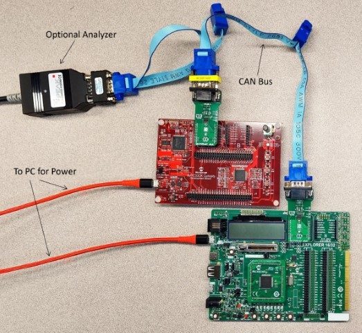

<!-- Please do not change this logo with link -->

# CAN-TP demo

This example shows how to configure the CAN-TP module in MCC Melody for different devices to interact over a CAN bus. This also shows how CAN-TP handles the messages over the CAN bus.

## Related Documentation

[CAN-TP Documentation](https://onlinedocs.microchip.com/oxy/GUID-9C356E20-C5BD-430F-8C0B-CCA1B85ECC7C-en-US-1/GUID-819906F0-FAB5-48EC-8698-1788965B4BAD.html)

## Software Used

### Required Software

- [MPLAB® X IDE](https://www.microchip.com/en-us/tools-resources/develop/mplab-x-ide) **6.05** or newer
- [MPLAB® XC16 Compiler](https://www.microchip.com/en-us/tools-resources/develop/mplab-xc-compilers) **2.00** or a newer compiler 
- [MPLAB® Code Configurator (MCC)](https://www.microchip.com/en-us/tools-resources/configure/mplab-code-configurator) **5.2.2** or newer 
- [MPLAB® Code Configurator (MCC) Melody](https://www.microchip.com/en-us/tools-resources/configure/mplab-code-configurator/melody) **2.3.1** or newer 

### Optional Software

- [PCAN-View](https://www.peak-system.com/PCAN-USB-FD.365.0.html?&L=1) for recording on the CAN bus

## Hardware Used

### Required Hardware
- Debugging tool: [MPLAB® PICkit™ 4 In-Circuit Debugger](https://www.microchip.com/en-us/development-tool/PG164140) or PKOB (intermal PICkit)
- [MCP2542 CLICK](https://www.mikroe.com/mcp2542-click) x2
- CAN BUS - 1 to 1 CAN cable.
- 2 x Boards with CAN enabled devices on board. Devices can be Built-In Modules or Plug-in Modules (PIMs). (examples listed below as optional)

### Optional Hardware
- [dsPIC33CK CURIOSITY DEVELOPMENT BOARD](https://www.microchip.com/en-us/development-tool/DM330030)
- [EXPLORER 16/32 DEVELOPMENT BOARD](https://www.microchip.com/en-us/development-tool/dm240001-2)
- [dsPIC33CK256MP508 GENERAL PURPOSE PLUG-IN MODULE](https://www.microchip.com/en-us/development-tool/ma330042?utm_source=MicroSolutions&utm_medium=Article&utm_content=DevTools&utm_campaign=StandAlone)
- CAN BUS - n - n Multi Device CAN BUS for reading off the line with an analyzer.
- [CAN Terminator](https://www.gridconnect.com/collections/can-cables-connectors-terminators/products/can-terminator) (Used for CAN-FD and for the Analyzer)
- [PCAN-USB FD](https://www.peak-system.com/PCAN-USB-FD.365.0.html?&L=1) (Any CAN analyzer will work)

# Hardware Setup

The Hardware for this demo requires a CAN bus. This demo is meant for any 16-bit CAN supported devices in Melody. Below are examples of boards that can be used and their setup. If the demo being ran uses different boards with the MCP2542 Click Boards then refer to the boards/devices schematics and data sheets for information on the PIN selects. Check out (Commonly Used PIMS/Board PIN Selections) section below for more information.

*Figure 1 - Setup of the CAN demo*

1. The Explorer 16/32 board requires the following:

    - MCP2542 Click - inserted into the mikro bus A slot
    - dsPIC33CK256MP508 PIM inserted into the designated slot

2. The Curiosity board requires the following:

    - MCP2542 Click - inserted into the mikro bus A slot

The devices can then be connected to each other via click boards using a CAN Bus cable.
    - Note: An 120 ohm CAN Bus Terminator may be required.

Optional: Connect a CAN analyzer of your choosing to the CAN bus to view the CAN packets being sent over the bus. This will determine what frames CAN-TP are sending. 

# Software Setup

You can use any two boards that support CAN/CAN-FD and has an LED and at least one button to trigger the start of the loop. Setup requires the schematics for the boards being used. Each board has different I/O Pin Mapping to the mikro Bus and will need to be configured correctly to work. This goes for the LED and Button pins selected as well. The setup below describes the setup for the two boards as well as the can configurations to use.

Open the CAN-TP project in MPLAB® X IDE and do the following setup:

## Setup for Board 1:

    If the device you are using matches the default project one you can continue to the pin configurations. If not, right click the project folder and select Properties. Change the device to the one you are using and select an XC compiler. Apply these settings and continue with the next steps.

    1. Ensure the following is selected:
        - CAN-TP is added to the project and configure the following:
            - TMR1 for the timer dependency for CAN-TP
            - MessageID is set to 0xA1

    2. PIN CONFIGURATIONS:
    Select an LED output, Button Input and CAN Tx and Rx pins in the PIN Grid View for your board. (View PIN mapping and choose them accordingly) This test utilizes the MCP2542 Click board for CAN communication. The mapping to the mikro BUS will vary.

    *If you are using the example board skip to the Example Setup Below.
        - Select an LED as output
        - Select an Button for input
        - Select the CAN1TX for your board
        - Select the CAN1RX for your board

    (EXAMPLE SETUP) To simplify setup if the board is a Explorer 16/32 with a dsPIC33CK256MP508 Select the following
        - Select RE6 as output - for LED
        - Select RB14 as input  - for BUTTON
        - Select RD1 for CAN1TX
        - Select RD0 for CAN1RX

    3. Then select Pins under the Project Resources:
        - For the button input enable Weak pullup, interrupt on negative change, and change the custom name to be BUTTON.
        - For the led output change the custom name to be LED.

     4. Select CAN_FD1 and do the following:
        - Enable Data Bit Rate and Set Bit Rate to 2Mbps
        - In filter0's Message ID Set it to 0xA2

    Select the Generate Button under project resources.
    
    Ensure not to overwrite the contents of the main.c.

    Build and Program the board.

## Setup for Board 2:

    Using the same project.

    If the device you are using matches the default Project one you can continue to the pin configurations. If not, Right click the project folder and select Properties. Change the device to the one you are using and select an XC compiler. Apply these settings and continue with the next steps.

    1. Ensure the following is selected:
        - CAN-TP is added to the project and configure the following:
            - TMR1 for the timer dependency for CAN-TP
            - MessageID is set to 0xA2

    2. PIN CONFIGURATIONS:
    Select an LED output and CAN Tx and Rx pins in the PIN Grid View for your board. (View PIN mapping and choose them accordingly) This test utilizes the MCP2542 Click board for CAN communication. The mapping to the mikro BUS will vary.

    *If you are using the example board skip to the Example Setup Below.
    * Select an LED as output
    * Select the CAN1TX for your board
    * Select the CAN1RX for your board

    (EXAMPLE SETUP) To simplify setup if the board is a dsPIC33CK Curiosity Dev Board which has a built in dsPIC33CK256MP508 Select the following
    * Select RE14 as output - for LED
    * Select RD14 for CAN1TX
    * Select RD15 for CAN1RX

    3. Then select Pins under the Project Resources.
    * For the led output change the custom name to be LED.

    4. Select CAN_FD1 and do the following
    * Enable Data Bit Rate and Set Bit Rate to 2Mbps
    * In filter0's Message ID Set it to 0xA1

    Select the Generate Button under project resources.

    Ensure not to overwrite the contents of the main.c.
    
    5. For this board comment out line 28 to be (//#define STARTING_BOARD)

    Build and Program the board.

# Operation

After Programming both boards, ensure both are powered and attached to the CAN bus using the click boards. Next press the S1 button on Board 1. This will start the back and forth Message passing between the two devices. This will continue until stopped manually by removing power from one of the devices.

*Figure 2 - Recording over the CAN bus*

# CAN-TP Project - Drivers

The CAN-TP project uses the following:

 - MCC Melody CAN-TP Library
 - MCC Melody CAN-FD driver
 - 1ms Timer
 - LED (For both boards)
 - Button (For one of the two boards)

This project can be opened in MPLAB® X IDE and programmed to any board capable of using CAN.

Project functions and Descriptions:
|Function|Description|
|----|----|
|SetTicks(int)|Updates the current Tick count states.|
|BUTTON_Pressed()|Called by the button interrupt to start the sending loop.|
|UPDATE_Message()|Updates the state in the Tx message to send to the other board.|
|LED_Tick()|Decrement counter that will update the current blink duration.|
|CUSTOM_TICKS()|Calls the CAN_TP_TICK and LED_TICK function. This also checks the tick count to toggle the led.|

# Commonly Used PIMS/Board PIN Selections

- The following is assuming the MCP2542 click board is in micro BUS A in both Boards

    |Board|PIM/On Board|CAN_RX|CAN_TX|LED(output)|BUTTON(input)|
    |---|---|---|---|---|---|
    |Explorer 16/32|(PIM)dsPIC33CK256MP508|PORTD0|PORTD1|PORTE0|PORTB14|
    |Explorer 16/32|(PIM)dsPIC33CK512MP608|PORTD0|PORTD1|PORTE0|PORTB14|
    |dsPIC33CK Curiosity|(On Board)dsPIC33CK256MP508|PORTD15|PORTD14|PORTE14|PORTE7|

- For any other boards/PIMS/Melody Devices check the PIN mapping to the Click board's RX and TX pins as well as selecting an LED as output and a button for input.
