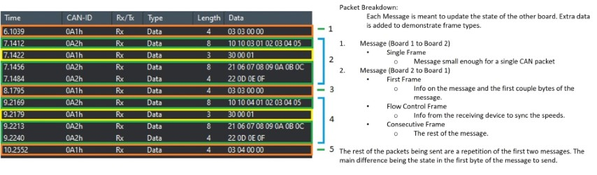

<!-- Please do not change this logo with link -->

# dsPIC33C CAN-TP Demo

The dsPIC33C CAN-TP Demo shows how to configure the CAN-TP module in MCC Melody for different devices to interact over a CAN bus. The demo also shows how CAN-TP handles messages over the CAN bus.

The MPLAB® X demo projects are set up to utilize specific boards defined in the required hardware section below. The dsPIC33C CAN-TP Demo utilizes resources that are available on most boards(LEDs, Buttons, and mikroBUS slot) allowing the project to be portable to other hardware.

## Related Documentation

[CAN-TP Documentation](https://onlinedocs.microchip.com/oxy/GUID-9C356E20-C5BD-430F-8C0B-CCA1B85ECC7C-en-US-1/GUID-819906F0-FAB5-48EC-8698-1788965B4BAD.html)

## Software Used

### Required Software

- MPLAB® X IDE  **6.05** or newer (https://www.microchip.com/MPLABXIDE)
- MPLAB® XC16 Compiler **2.00** or a newer compiler (https://www.microchip.com/xc16) 
- MPLAB® Code Configurator (MCC) **5.2.2** or newer (https://www.microchip.com/mcc)
- MPLAB® Code Configurator (MCC) Melody **2.3.1** or newer (https://www.microchip.com/melody)

### Optional Software

- PCAN-View for recording on the CAN bus (https://www.peak-system.com/PCAN-USB-FD.365.0.html?&L=1)

## Hardware Used

### Required Hardware
- Debugging tool: MPLAB® PICkit™ 4 In-Circuit Debugger (https://www.microchip.com/PICkit4) or PKOB (PICkit On-Board)
- MCP2542 Click x2 (https://www.mikroe.com/mcp2542-click)
- CAN BUS - 1 to 1 CAN cable.
- dsPIC33CK Curiosity Development Board (https://www.microchip.com/dsPIC33CKCuriosity)
- Explorer 16/32 Development Board (https://www.microchip.com/Explorer1632)
- dsPIC33CK256MP508 General Purpose Plug-in Module (https://www.microchip.com/MA330042)

### Optional Hardware
- CAN BUS - n to n Multi Device CAN BUS for reading off the line with an analyzer.
- CAN Terminator (https://www.gridconnect.com/collections/can-cables-connectors-terminators/products/can-terminator) (Used for CAN-FD and for the Analyzer)
- PCAN-USB FD (https://www.peak-system.com/PCAN-USB-FD.365.0.html?&L=1) (Any CAN analyzer will work)

# Hardware Setup

The dsPIC33C CAN-TP Demo were created for the Explorer 16/32 with a dsPIC33CK256MP508 PIM and a dsPIC33CK Curiosity Board for their support CAN/CAN-FD communication in Melody. If different boards or devices will be used with the MCP2542 Click Boards then refer to the **Porting the CAN-TP demo to use a Custom Board/Device** Section below.

*Figure 1 - Setup of the dsPIC33C CAN-TP Demo*

1. The Explorer 16/32 board requires the following:

    - MCP2542 Click - inserted into the mikroBUS A slot
    - dsPIC33CK256MP508 PIM inserted into the designated slot

2. The Curiosity board requires the following:

    - MCP2542 Click - inserted into the mikroBUS A slot

The devices can then be connected to each other via click boards using a CAN Bus cable.
    - Note: An 120 ohm CAN Bus Terminator may be required.

Optional: Connect a CAN analyzer of your choosing to the CAN bus to view the CAN packets being sent over the bus. This will determine what frames CAN-TP are sending. 

# Software Setup

## Programming the Explorer 16/32 board with dsPIC33CK256MP508 PIM
    1. Open the dspic33ck-exp1632-can-tp.X in .
    2. Ensure the project is set as the main project in the IDE by selecting the "Projects" tab on the left side of MPLAB® X and right clicking the project and selecting "Set as Main Project".
    3. At this point plug in the PICKit 4 from the board to the PC or the PKOB (PICkit On-Board) to the PC.
    4. Now you are ready to program the device by selecting the "Make and Program Device (Project dspic33ck-exp1632-can-tp)" button on the top menu bar.
    5. This will build the project and program the device.
    

## Setup for project: dspic33ck-curiosity-can-tp
    1. Open the dspic33ck-curiosity-can-tp.X in .
    2. Ensure the project is set as the main project in melody by selecting the "Projects" tab on the left side of MPLAB® X and right clicking the project and selecting "Set as Main Project".
    3. At this point plug the PKOB (PICkit On-Board) to the PC.
    4. Now you are ready to program the device by selecting the "Make and Program Device (Project dspic33ck-curiosity-can-tp)" button on the top menu bar.
    5. This will build the project and program the device.

# Operation

After programming both boards, ensure both are powered and attached to the CAN bus using the click boards. Next press the S1 button on Explorer 16/32. This will start the back and forth Message passing between the two devices. This will continue until stopped manually by removing power from one of the devices.

*Figure 2 - Recording over the CAN bus*

# Porting the CAN-TP demo to use a Custom Board/Device
You can use any dsPIC device that support CAN/CAN-FD and has an LED and at least one button to trigger the start of the loop. Setup requires the schematics for the boards being used. Each board has different I/O Pin Mapping to the mikroBUS and will need to be configured correctly to work. This goes for the LED and Button pins selected as well. The setup below describes the setup for the two boards as well as the CAN/CAN-FD configurations to use. Check out (Commonly Used PIMS/Board PIN Selections) section below for more information.

## Setup for Board 1:

    The project for board 1 is meant to kick off the message sending. It requires a button and an led. This will utilize the dspic33ck-exp1632-can-tp to receive, process and respond to devices with an ID of 0xA2.

    With the dspic33ck-exp1632-can-tp.X project open in the MPLAB® X IDE. 

    Right click the project folder and select Properties. Change the device to the one you are using and select an XC compiler. Apply these settings and continue with the next steps.

    1. Ensure the following is selected:
        - CAN-TP is added to the project and configure the following:
            - TMR1 for the timer dependency for CAN-TP
            - MessageID is set to 0xA1

    2. PIN CONFIGURATIONS:
    Select an LED output, Button Input and CAN Tx and Rx pins in the PIN Grid View for your board. (View PIN mapping and choose them accordingly) This test utilizes the MCP2542 Click board for CAN communication. The mapping to the mikroBUS will vary.

        - Select an LED as output
        - Select an Button for input
        - Select the CAN1TX for your board
        - Select the CAN1RX for your board

    3. Then select Pins under the Project Resources:
        - For the button input enable Weak pullup, interrupt on negative change, and change the custom name to be BUTTON
        - For the led output change the custom name to be LED

     4. Select CAN_FD1 and do the following:
        - Enable Data Bit Rate and Set Bit Rate to 2Mbps
        - In filter0's Message ID Set it to 0xA2

    Select the Generate Button under project resources.
    
    Ensure not to overwrite the contents of the main.c.

    Build and Program the board.

## Setup for Board 2:

   The project for board 2 is meant to wait until it receives a message before responding. It requires an led. This will utilize the dspic33ck-curiosity-can-tp to receive, process and respond to devices with an ID of 0xA1.

    With the dspic33ck-curiosity-can-tp.X project open in the MPLAB® X IDE. 

    Right click the project folder and select Properties. Change the device to the one you are using and select an XC compiler. Apply these settings and continue with the next steps.

    1. Ensure the following is selected:
        - CAN-TP is added to the project and configure the following:
            - TMR1 for the timer dependency for CAN-TP
            - MessageID is set to 0xA2

    2. PIN CONFIGURATIONS:
    Select an LED output and CAN Tx and Rx pins in the PIN Grid View for your board. (View PIN mapping and choose them accordingly) This test utilizes the MCP2542 Click board for CAN communication. The mapping to the mikroBUS will vary.

        - Select an LED as output
        - Select the CAN1TX for your board
        - Select the CAN1RX for your board

    3. Then select Pins under the Project Resources
        - For the led output change the custom name to be LED

    4. Select CAN_FD1 and do the following:
        - Enable Data Bit Rate and Set Bit Rate to 2Mbps
        - In filter0's Message ID Set it to 0xA1

    Select the Generate Button under project resources.

    Ensure not to overwrite the contents of the main.c.

    Build and Program the board.
    
# CAN-TP Project - Drivers

The CAN-TP project uses the following:

 - MCC Melody CAN-TP Library
 - MCC Melody CAN-FD driver
 - 1ms Timer
 - LED (For both boards)
 - Button (For one of the two boards)

This project can be opened in MPLAB® X IDE and programmed to any board capable of using CAN.

Project functions and Descriptions:

|Function|Description|
|---|---|
|SetTicks(int)|Updates the current Tick count states.|
|BUTTON_Pressed()|Called by the button interrupt to start the sending loop.|
|UPDATE_Message()|Updates the state in the Tx message to send to the other board.|
|LED_Tick()|Decrement counter that will update the current blink duration.|
|CUSTOM_TICKS()|Calls the CAN_TP_TICK and LED_TICK function. This also checks the tick count to toggle the led.|

# Commonly Used PIMS/Board PIN Selections

- The following is assuming the MCP2542 click board is in micro BUS A in both Boards

    |Board|PIM/On Board|CAN_RX|CAN_TX|LED(output)|BUTTON(input)|
    |---|---|---|---|---|---|
    |Explorer 16/32|(PIM)dsPIC33CK256MP508|PORTD0|PORTD1|PORTE0|PORTB14|
    |Explorer 16/32|(PIM)dsPIC33CK512MP608|PORTD0|PORTD1|PORTE0|PORTB14|
    |dsPIC33CK Curiosity|(On Board)dsPIC33CK256MP508|PORTD15|PORTD14|PORTE14|PORTE7|

- For any other boards/PIMS/Melody Devices check the PIN mapping to the Click board's RX and TX pins as well as selecting an LED as output and a button for input.
